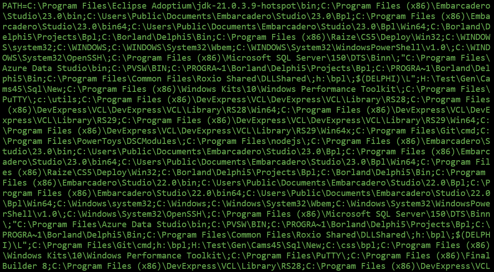
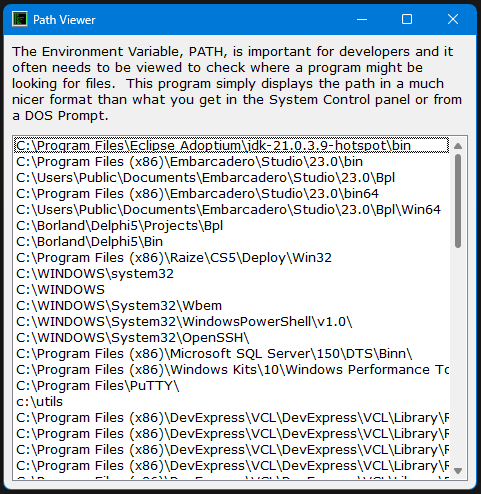

PathViewer
==========

Have you ever typed `PATH` at the command line and seem something like this?  

This tool displays the parsed paths of the PATH environment variable in a window so you can clearly see the various paths for your environment without going through the Windows settings and bringing up its editor. Just put this somewhere in your path and call `PathViewer` whenever you need to check if a folder is in your path.

Written in 2013, probably with Delphi XE, compiles without any modification in today's version of Delphi.

Isn't this nicer?  

